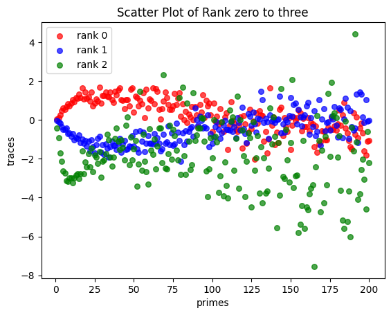
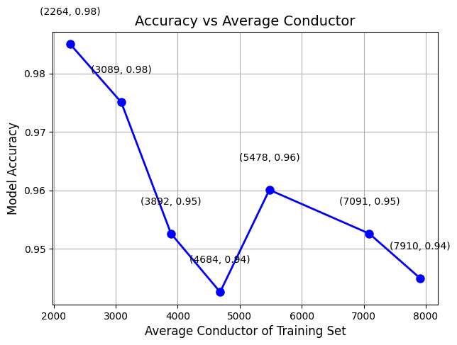
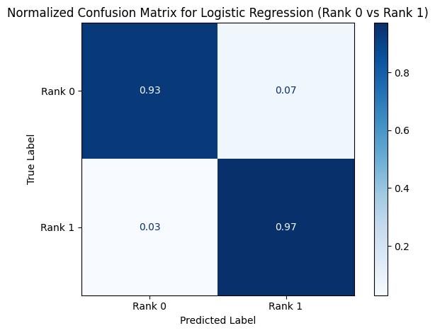

# Predicting Elliptic Curve Ranks

This work was completed in collaboration with **Vincent Gia Khanh** as part of the **Inspirit AI+X program**, with mentorship from **William DeGroot**.

Can a simple classifier distinguish elliptic curves by rank using their Frobenius traces? This project explores that question with logistic regression and **murmurations**: plots of average traces grouped by rank. This project was inspired by Murmurations of Elliptic Curves and He, Lee, and Oliver’s Machine Learning Invariants of Arithmetic Curves, building on their exploration of rank-dependent patterns in Frobenius traces and logistic regression for elliptic curve rank prediction.

📄 **[Read Vincent's full paper](Vincent_inspirit_final_paper.pdf)**

## Experiments

- **Rank classification:** train logistic regression on 200 Frobenius-trace features with an 80/20 train/test split. The main conductor comparisons classify ranks 0 and 1; the notebook also includes an exploratory rank 0/1/2 model.
- **Conductor comparisons:** compare the lowest- and highest-conductor samples within each rank, then evaluate overlapping windows through the conductor-sorted data.
- **Murmurations and errors:** visualize average traces for ranks 0–2, compare low/high conductor groups, and inspect raw and normalized confusion matrices.

The paper reports roughly **98% accuracy** for lower-conductor subsets and **94–95%** for higher-conductor subsets, with a non-monotonic decline across the tested windows. These are historical experimental results, not guarantees for unseen conductor ranges.

## A glimpse of the results







Figures above are extracted from the paper. Additional original notebook plots are in [`figures/`](figures/). The trace plots use prime **indices** 1–200 on the horizontal axis.

## Run it

```bash
python -m pip install -r requirements.txt
python training_and_visualizations.py
```

The script reads the bundled CSV, prints evaluation results, and saves fresh plots to `outputs/`. No Colab upload or data download is required.

- `elliptic_curve_data.csv`: 5,000 curves with conductors 11–9,999; 2,371 rank 0, 2,433 rank 1, and 196 rank 2. Column `0` is conductor, `4` is rank, and `6`–`205` are the 200 trace features.
- `dataset_generation.ipynb`: original Colab notebook with saved analyses and figures, retained under its supplied filename. Its setup uses Colab and expects the CSV under the historical name `output2.csv`.
- `training_and_visualizations.py`: portable version of the exported analysis, with fixed split seed 42 and automatic figure saving.

The bundled snapshot and notebook results differ from some counts and runs described in the paper. The original subset slices and model settings are preserved, including the final slice `1200:2201`; new seeded runs need not match historical accuracies. The extra low/high pooled experiment can contain duplicate curves because those subsets overlap. Treat it as exploratory rather than an independent generalization estimate. The original 1,000-iteration optimizer limit may emit convergence warnings.
